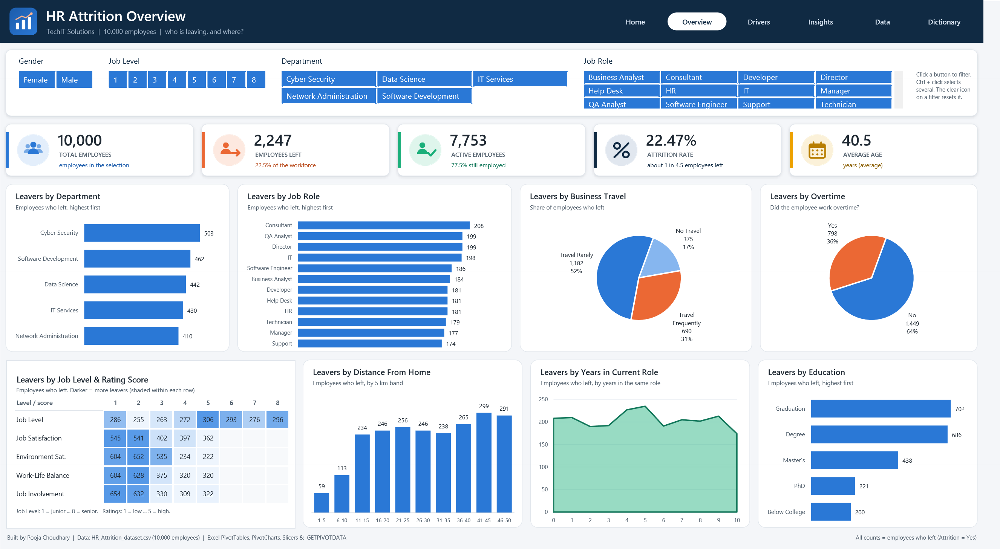
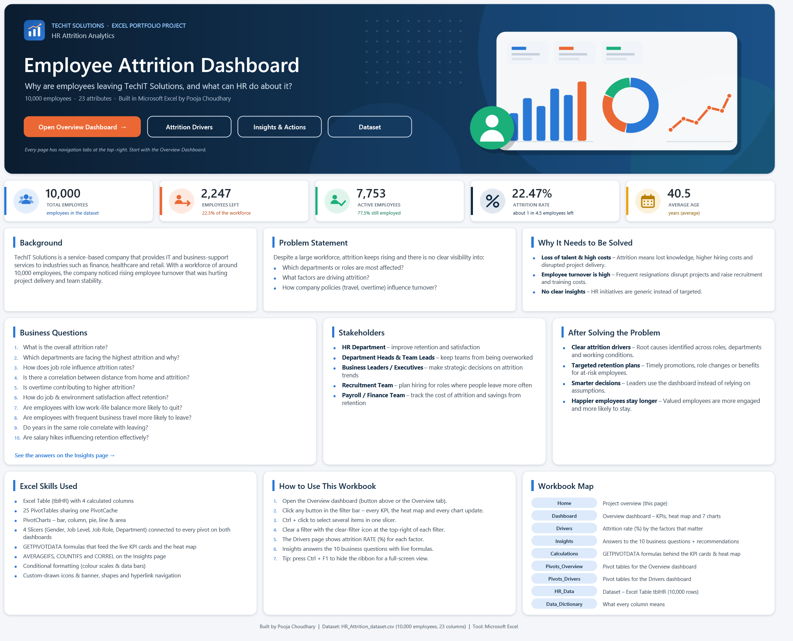
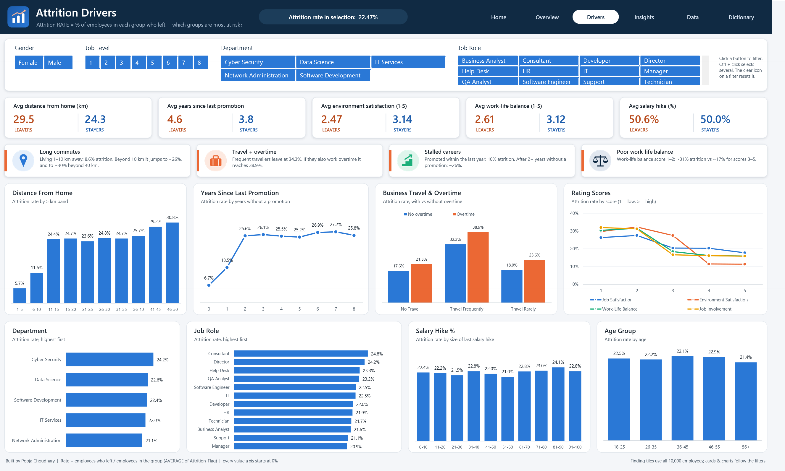
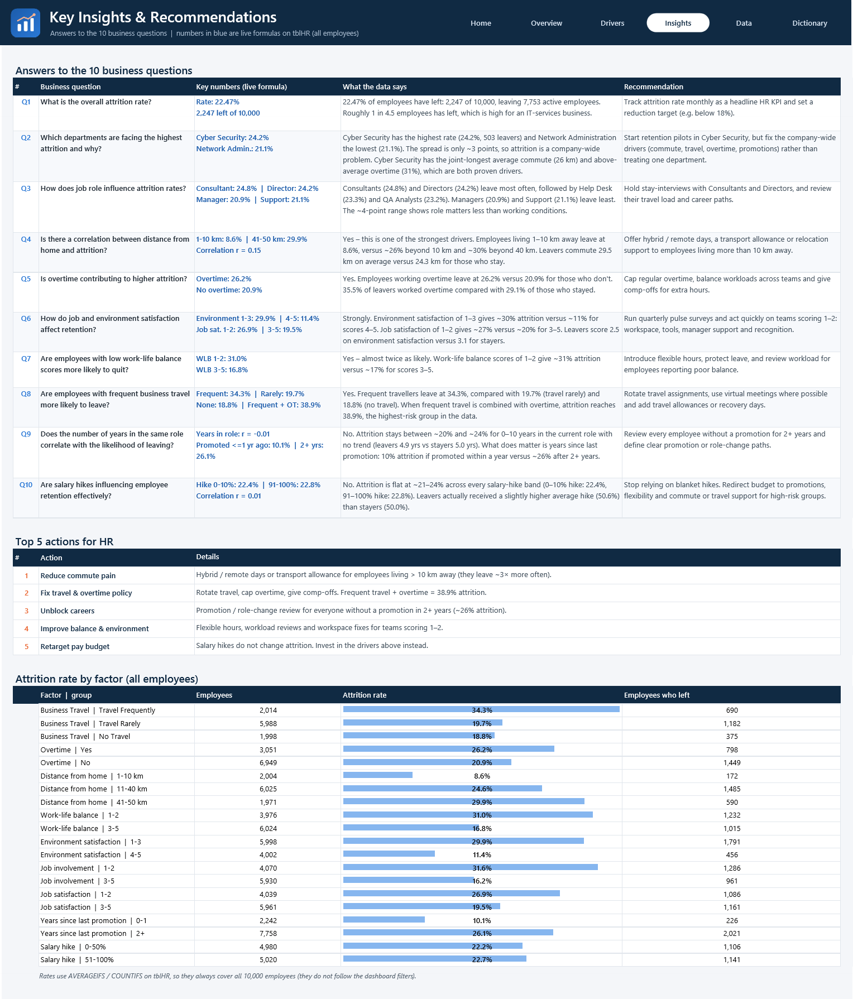

# 👥 HR Attrition Analysis — Interactive Excel Dashboard

TechIT Solutions, an IT-services company with **10,000 employees**, is losing people faster than it can replace them. I analysed its HR dataset (23 attributes per employee) and built an **interactive Excel dashboard**. It shows how many employees are leaving, **who** is leaving, and **why**, and gives HR five targeted actions to reduce attrition.

**Tools:** Excel · Excel Tables & calculated columns · Pivot Tables & Pivot Charts · Slicers · GETPIVOTDATA · AVERAGEIFS / COUNTIFS / CORREL · Conditional formatting (heat map & data bars)



---

## 📌 Contents
- [Business Problem](#-business-problem)
- [Dataset](#️-dataset)
- [Approach](#-approach)
- [KPIs](#-kpis)
- [Dashboard](#️-dashboard)
- [Key Insights](#-key-insights)
- [Recommendations](#-recommendations)
- [Workbook Tour](#-workbook-tour)
- [How to Use](#️-how-to-use)
- [Repository Structure](#-repository-structure)
- [Author](#-author)

---

## 🧩 Business Problem

**Background.** TechIT Solutions provides IT and business-support services to industries such as finance, healthcare and retail. Rising employee turnover is hurting project delivery and team stability, and HR has no clear view of which departments or roles are affected, what is driving attrition, or how policies such as travel and overtime influence it.

**Stakeholders:** HR Department · Department Heads & Team Leads · Business Leaders · Recruitment Team · Payroll / Finance.

| # | Business question |
|---|---|
| Q1 | What is the overall attrition rate? |
| Q2 | Which departments are facing the highest attrition and why? |
| Q3 | How does job role influence attrition rates? |
| Q4 | Is there a correlation between distance from home and attrition rate? |
| Q5 | Is overtime contributing to higher attrition? |
| Q6 | How do job satisfaction and environment satisfaction affect employee retention? |
| Q7 | Are employees with low work-life balance scores more likely to quit? |
| Q8 | Are employees with frequent business travel more likely to leave? |
| Q9 | Does the number of years in the same role correlate with the likelihood of leaving? |
| Q10 | Are salary hikes influencing employee retention effectively? |

---

## 🗂️ Dataset

`dataset/HR_Attrition_dataset.csv` has **10,000 rows × 23 columns**, one row per employee.

| Group | Columns |
|---|---|
| Identity & demographics | Employee_ID, Age, Gender, Marital_Status, Education |
| Job | Department (5), Job_Role (12), Job_Level (1–8), Salary, Salary_Hike_in_percent |
| Working conditions | Business_Travel, Overtime, Distance_From_Home (km) |
| Ratings (1–5) | Job_Satisfaction, Environment_Satisfaction, Job_Involvement, Work_life_balance |
| Tenure | Total_working_years_experience, No_of_years_worked_at_current_company, No_of_years_in_current_role, Years_since_last_promotion, Number_of_Companies_Worked_previously |
| Target | **Attrition** (Yes / No) |

The full column list with descriptions is on the `Data_Dictionary` sheet.

---

## 🔄 Approach

1. **Load & structure:** imported the CSV into an Excel Table (`tblHR`), so every formula and pivot uses structured references.
2. **Calculated columns:** `Attrition_Flag` (1 = left, 0 = stayed), `Age_Group`, `Distance_Band` (5 km buckets) and `Salary_Hike_Band` (10 % buckets).
   A 1/0 flag makes the maths simple: **SUM = number of leavers** and **AVERAGE = attrition rate**.
3. **Pivot analysis:** **25 PivotTables** on one shared PivotCache. Counts feed the Overview page and rates (AVERAGE of the flag) feed the Drivers page.
4. **Interactivity:** **4 slicers** (Gender, Job Level, Job Role, Department) are connected to every pivot, and both dashboards share the same slicer caches, so a filter on one page also applies on the other.
5. **Live KPI cards & heat map:** `GETPIVOTDATA` formulas on the `Calculations` sheet feed text boxes linked to cells, so the KPI cards and the heat map update with every click.
6. **Answers:** the Insights sheet answers all 10 questions with live `AVERAGEIFS`, `COUNTIFS` and `CORREL` formulas plus a written insight and recommendation.
7. **Validation:** KPIs match the reference Power BI dashboard exactly (10,000 / 2,247 / 7,753 / 22.47% / 40). The workbook has zero formula errors, including when filtered.

---

## 📊 KPIs

| KPI | Value | How it is calculated |
|---|---|---|
| Total Employees | **10,000** | Count of Employee_ID |
| Total Attrition | **2,247** | SUM of Attrition_Flag |
| Active Employees | **7,753** | Total Employees − Total Attrition |
| Attrition Rate | **22.47%** | Total Attrition ÷ Total Employees |
| Average Age | **40** | AVERAGE of Age |

---

## 🖥️ Dashboard

### Home
Project overview, company-wide KPIs, business questions, stakeholders and links to every page.


### Overview Dashboard
A top filter bar, five KPI cards, a heat map of leavers by job level and rating score (conditional-formatting colour scales), and 7 charts: department, job role, business travel, overtime, distance from home, years in current role and education.


### Attrition Drivers
**Attrition rate (%)** by the factors that matter, plus Leavers-vs-Stayers averages and four key-finding tiles.


### Insights & Recommendations


---

## 🔍 Key Insights

| # | Answer |
|---|---|
| **Q1** | **22.47%** attrition: 2,247 of 10,000 employees have left, roughly 1 in 4.5. |
| **Q2** | **Cyber Security** is highest (24.2%) and Network Administration lowest (21.1%). The spread is only ~3 points, so attrition is a company-wide problem rather than a department one. |
| **Q3** | **Consultants (24.8%)** and **Directors (24.2%)** leave most, and Managers (20.9%) least. Role matters less than working conditions. |
| **Q4** | **Yes, it is a strong driver.** Employees within 1–10 km leave at **8.6%**, versus **~26%** beyond 10 km and **~30%** beyond 40 km. |
| **Q5** | **Yes.** Overtime: **26.2%** vs 20.9% without. 35.5% of leavers worked overtime. |
| **Q6** | **Strongly.** Environment satisfaction 1–3 → ~30% vs **11.4%** for 4–5. Job satisfaction 1–2 → 26.9% vs 19.5%. |
| **Q7** | **Yes, almost twice as likely.** Work-life balance 1–2 → **31.0%** vs 16.8% for 3–5. |
| **Q8** | **Yes.** Frequent travellers leave at **34.3%** vs ~19% for the rest, and **38.9%** when combined with overtime (the highest-risk group). |
| **Q9** | **No.** Years in the current role show no trend (r ≈ 0). *Years since last promotion* does matter: 10.1% if promoted within a year vs **26.1%** after 2+ years. |
| **Q10** | **No.** Attrition is flat (~21–24%) across every salary-hike band, and leavers got a slightly *higher* average hike (50.6% vs 50.0%). |

---

## 💡 Recommendations

1. **Reduce commute pain.** Offer hybrid / remote days or a transport allowance to employees living more than 10 km away, who leave about 3× more often.
2. **Fix travel & overtime policy.** Rotate travel, cap overtime and give comp-offs, because frequent travel plus overtime means 38.9% attrition.
3. **Unblock careers.** Run a promotion or role-change review for everyone without a promotion in 2+ years (~26% attrition).
4. **Improve balance & environment.** Introduce flexible hours, workload reviews and workspace fixes for teams scoring 1–2.
5. **Retarget the pay budget.** Blanket salary hikes do not change attrition, so invest in the drivers above instead.

---

## 🧭 Workbook Tour

| Sheet | What it contains |
|---|---|
| **Home** | Project overview, company-wide KPIs, questions, stakeholders, skills used and links to every page |
| **Dashboard** | Overview dashboard: filter bar with 4 slicers, 5 KPI cards, a heat map and 7 charts |
| **Drivers** | Attrition-rate dashboard: Leavers vs Stayers cards, key findings and 8 rate charts |
| **Insights** | Answers to the 10 questions with live formulas, top 5 actions and an attrition-rate-by-factor table |
| **Calculations** | GETPIVOTDATA formulas behind the KPI cards, heat map and Drivers cards |
| **Pivots_Overview / Pivots_Drivers** | The 25 pivot tables that power the dashboards |
| **HR_Data** | The dataset as Excel Table `tblHR` (10,000 rows + 4 calculated columns) |
| **Data_Dictionary** | Description of every column and KPI |

---

## ▶️ How to Use

1. Download **`HR_Attrition_Analysis.xlsx`** (open the file above → *Download raw file*).
2. Open it in **Excel for Windows or Mac** (Microsoft 365 or Excel 2016+). Click *Enable Editing* if prompted.
3. Start on **Home** and use the buttons at the top-right of each page to move between pages.
4. Click any button in the **filter bar** to filter. Every KPI, the heat map and every chart update. Ctrl + click selects several items, and the ✕ icon clears a slicer.
5. No Excel? Open **`HR_Attrition_Dashboard.pdf`** for a quick look at all four pages.

---

## 📁 Repository Structure

```
HR-Attrition-Analysis/
├── HR_Attrition_Analysis.xlsx     # interactive workbook: dashboards + analysis sheets
├── HR_Attrition_Dashboard.pdf     # PDF preview of the 4 main pages
├── dataset/
│   └── HR_Attrition_dataset.csv   # raw data (10,000 employees)
├── images/                        # screenshots used in this README
├── assets/                        # logo, icons & banner drawn for this project
└── README.md
```

---

## 👩‍💻 Author

**Pooja Choudhary**, Data Analyst

*Dataset and business brief come from the HR Attrition Analytics case study by Ankit Raj Mishra (originally a Power BI project). The analysis and the Excel workbook were built independently.*

If you found this project useful, please ⭐ the repository. Feedback is always welcome!
